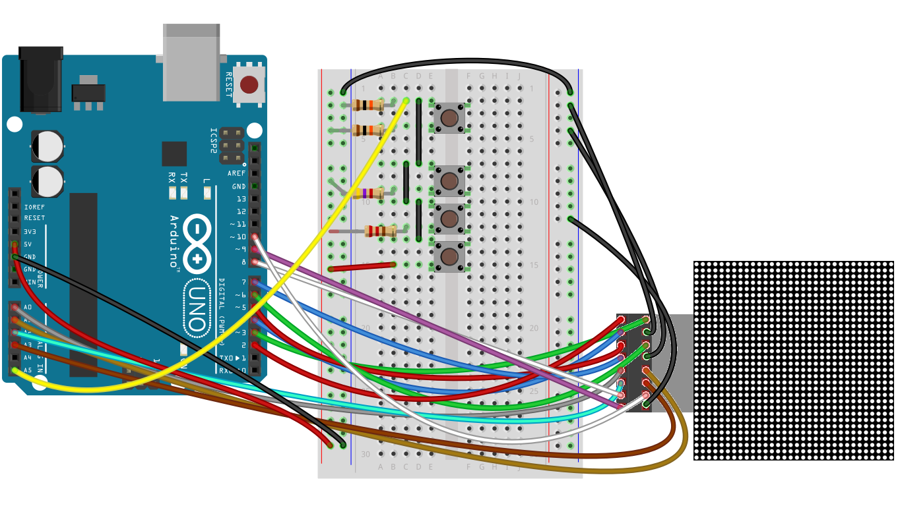

# LX' Arduino Tetris

A goal I set for myself for easter 2018: get a Tetris game running on a 32x32 LED matrix panel. This one uses Arduino/Genuino Uno as controller, which is rather limited in memory as I experienced. Large parts of the project consisted of finding ways around those limitations. Maybe I'll do a Arduino Mega adaptation for more memory in the near future.

The wiring is as follows:

This is basically the base wiring [Adafruit describes in their documentation](https://learn.adafruit.com/32x16-32x32-rgb-led-matrix/connecting-with-jumper-wires) with a resistor ladder for four control buttons added.

A demo of the game in action can be found on [YouTube](https://www.youtube.com/watch?v=rai_6IEXC00).

## Update 2018-04-07

Now there's a new branch called `mega` where I adapted the game for Arduino Mega. Instead of four pushbuttons I used a [4x4 membrane switch keypad](http://www.circuitbasics.com/how-to-set-up-a-keypad-on-an-arduino/). So far the pushbuttons had a better usability for me, though.

Also in the Mega version the colors of bricks in the bucket don't have to change when clearing lines. Mega's memory is sufficient to remember each pixel's color.